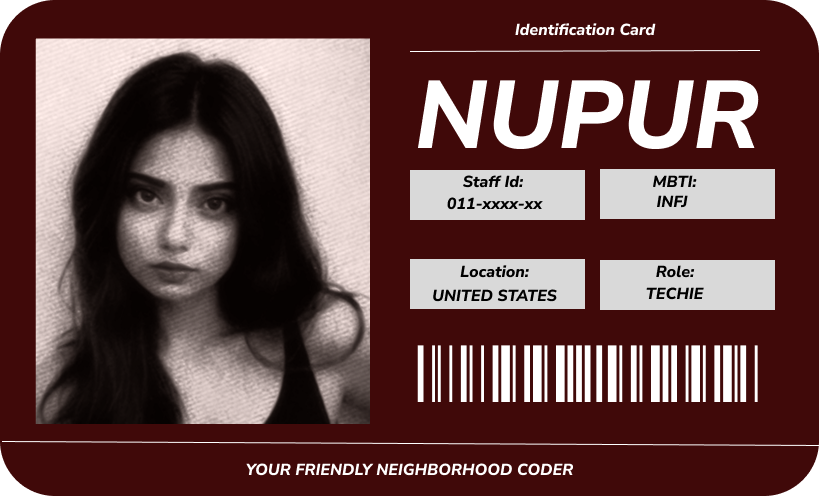
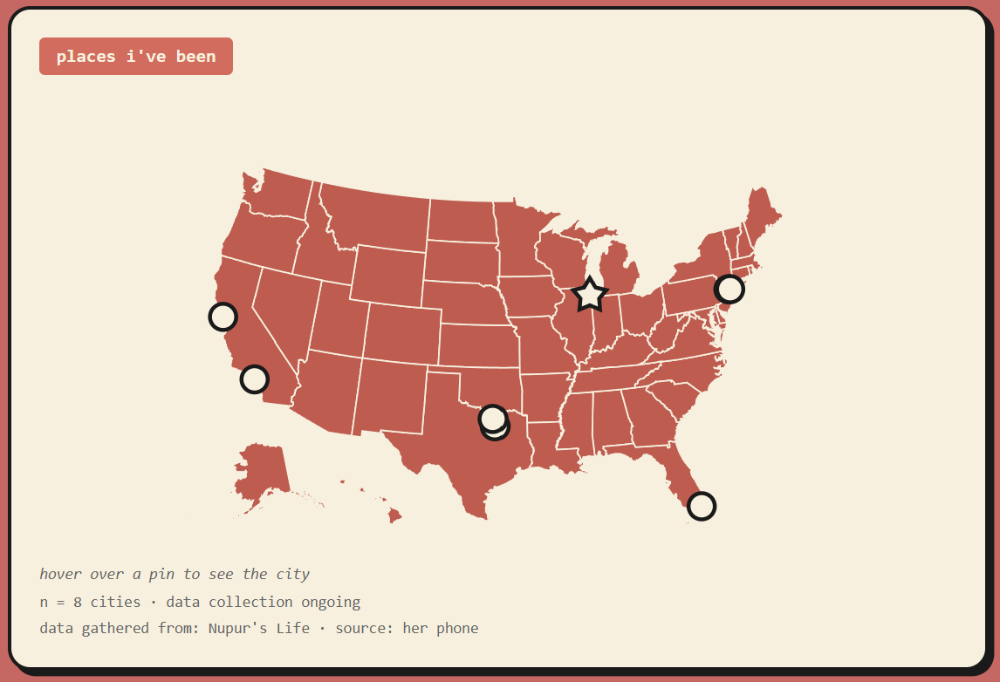
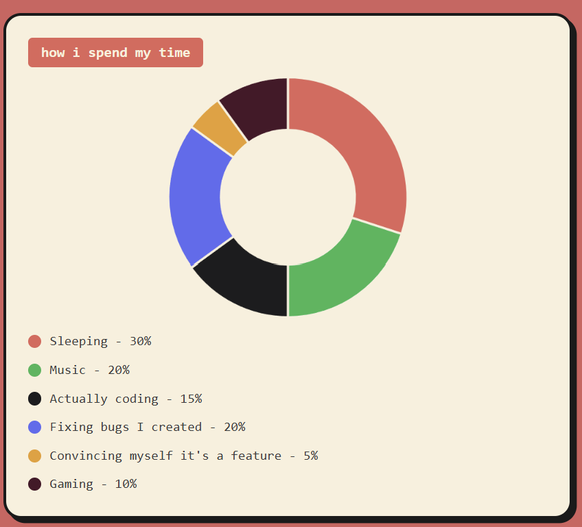
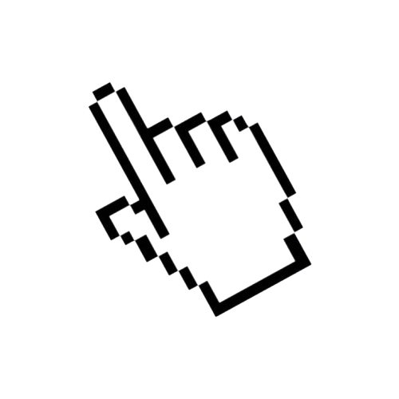
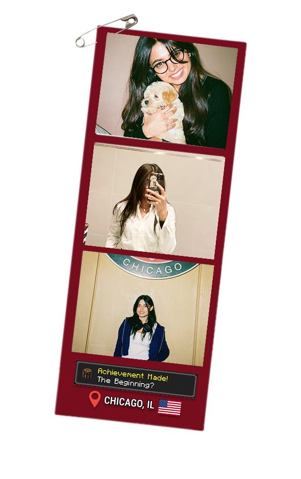
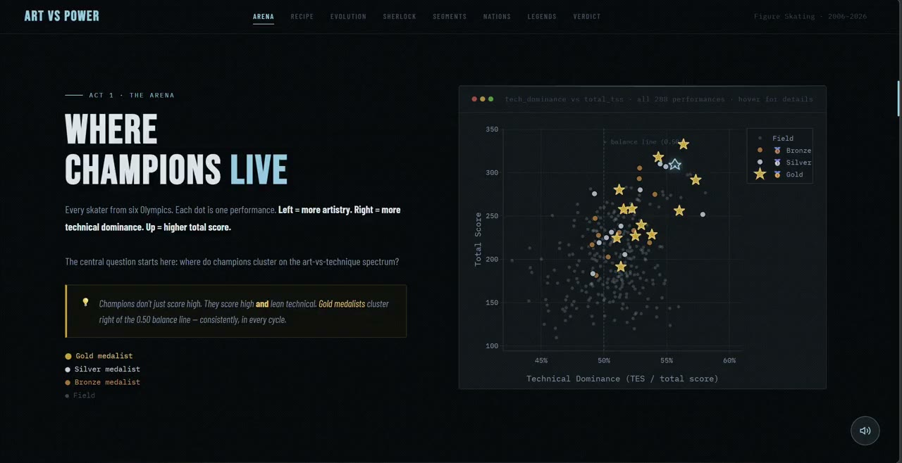
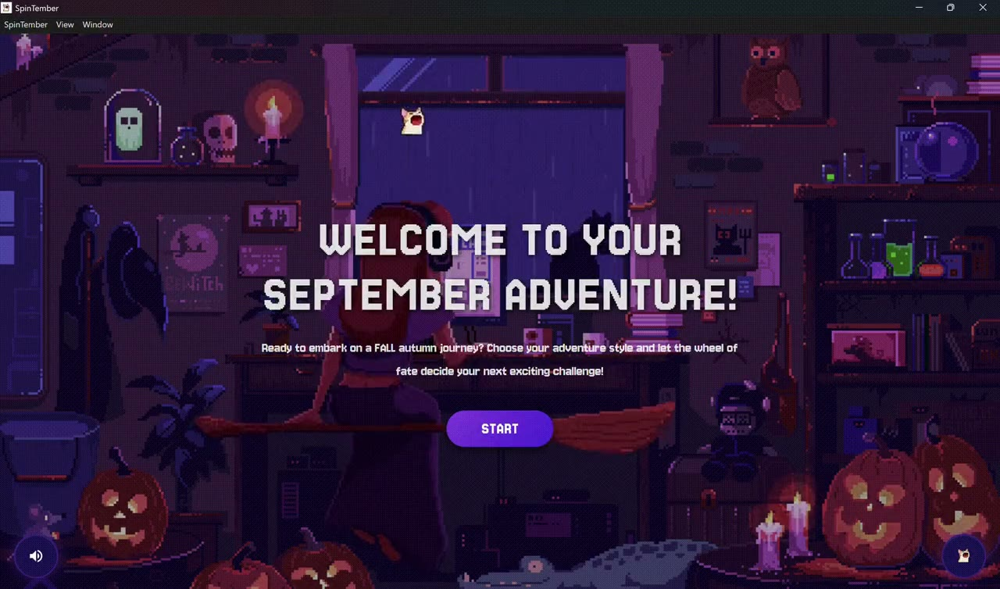
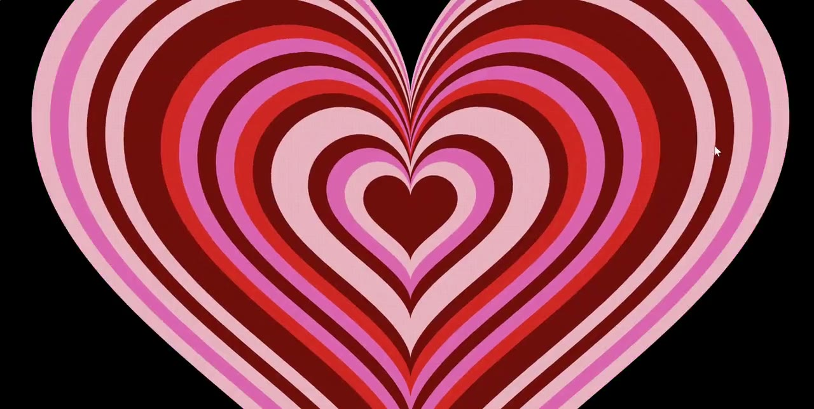
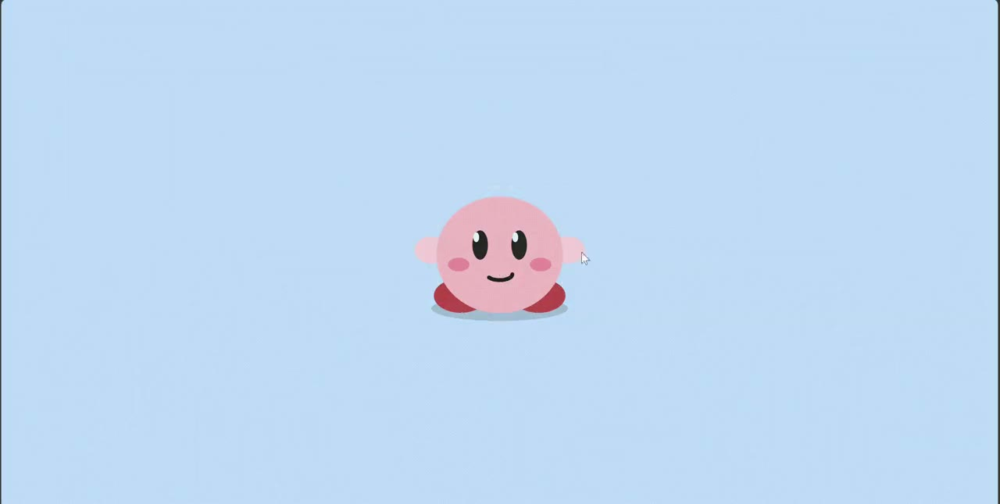

# Nupur Gudigar Portfolio

Scrapbook-style portfolio built with Next.js where you can drag and drop stickers as you scroll through my corporate, academic, and random fun memories.

	

## The Vibe

This is not a static resume page.

It is an interactive scrapbook experience with:

- A playful entry interaction with motion and transitions
- A long-form story layout across About, Work Experience, Projects, Extras, and Contact
- Drag-and-drop sticker interactions on desktop to personalize the page while exploring
- Animated project cards with rich media and fun-fact storytelling
- A dedicated "Beyond the Resume" dashboard for fun and random facts

## Beyond the Resume Dashboard

The portfolio includes a playful dashboard section focused on personal data and fun facts, including:

- A US travel-style map with city pins
- A chart that breaks down how I actually spend my time (music, coding, gaming, bug-fixing, and more)
- Random personality snapshots that make the portfolio feel more human than a typical resume site

This section is designed to blend data storytelling with personality, so visitors get both the professional and fun side of my journey.

## Dashboard Snapshots

	
	

## Scrapbook Preview

	
	

A few of the stickers used in the scrapbook experience:

	
	
	
	
	

## Project Memory Wall

These are some featured projects shown in the portfolio:

	
	
	

	

## Built With

- Next.js 16 (App Router)
- React 19
- TypeScript
- Tailwind CSS 4
- Framer Motion
- Chart.js + react-chartjs-2
- d3-geo + topojson-client
- Upstash Redis (view counter API)

## Contact

- GitHub: https://github.com/Nupur-Gudigar
- LinkedIn: https://www.linkedin.com/in/nupur-gudigar
- Email: nupurgudigar.tech@gmail.com

---

If you are here to evaluate the portfolio professionally, start with the work timeline and projects.
If you are here for the fun version, drag a sticker and make the page yours.